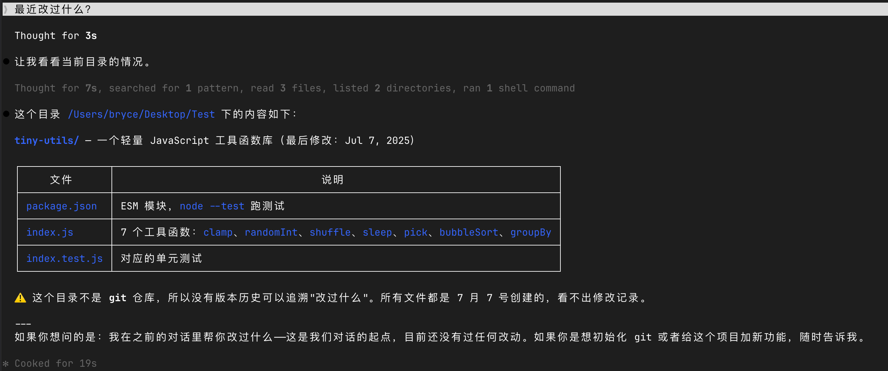
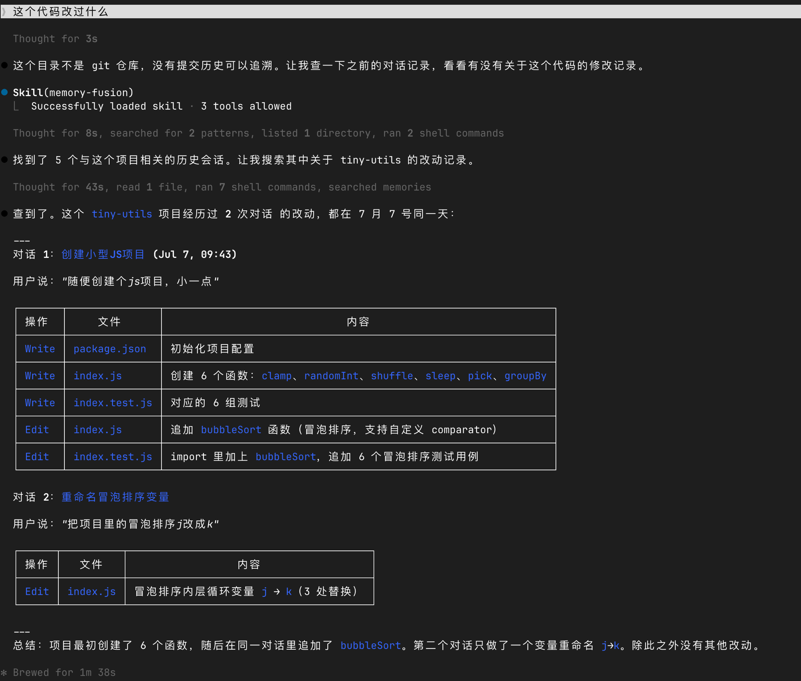

# MemoryFusion

面向 AI Coding Agent 的跨 Session 共享记忆。

为 Claude Code、Codex 以及其他 AI Coding Agent 提供持久化的项目记忆。

[English Docs →](./README.md)

---

## 效果演示

没有 MemoryFusion 时，问"这个代码改过什么"只能得到模糊的回复，查不到具体的改动历史：



安装 MemoryFusion 之后，同样的问题可以直接索引历史会话，精准定位每一次修改操作：



---

## 问题

AI Coding Agent 极大提升了开发效率，但它们都有一个共同的问题：**会失忆。**

- 新的 Claude Code Session 不知道昨天做了什么。
- Codex 不知道 Claude Code 已经完成了哪些工作。
- 架构决策、实现细节、踩坑经验，以及宝贵的项目上下文，都会随着 Session 结束而丢失。

MemoryFusion 通过构建一层**共享项目记忆**，解决这一问题。

它会持续索引历史 Session，并融合来自不同 AI Coding Agent 的上下文，让任何
支持的 Agent 都能够随时回忆过去的项目经验。

---

## 为什么选择 MemoryFusion？

没有长期记忆时：

- AI 会重复分析同一个问题
- 架构决策无法跨 Session 保留
- Bug 会被重复踩
- 项目经验不断流失
- Claude Code 与 Codex 无法共享上下文

**MemoryFusion 为你的项目提供真正的长期记忆。**

---

## 特性

- 🧠 跨 Session 记忆
- 🤝 Claude Code 与 Codex 共享项目记忆
- 🔍 自然语言查询历史
- 📂 基于项目上下文进行检索
- 📝 持续积累实现经验与技术决策
- ⚡ Local-first，本地优先
- 🔓 完全开源

---

## 安装

### 通过 skills CLI（推荐）

```bash
npx skills add Bryce-Zhao/memory-fusion
```

### 手动安装

```bash
git clone https://github.com/Bryce-Zhao/memory-fusion.git ~/Project/memory-fusion
ln -s ~/Project/memory-fusion ~/.claude/skills/memory-fusion
```

---

## 快速开始

安装后，在任意 Claude Code 会话中直接提问即可：

```
"之前那个 auth bug 怎么修的？"
"最近我在做什么？"
"login.ts 这个文件改过什么？"
```

当你提到过去的工作内容时，skill 会自动激活。

---

## 架构

```
~/.claude/projects/   ──┐
                        ├── index.mjs ──→ ~/.memory-fusion/
~/.codex/             ──┘                  ├── sessions.json
                                           └── messages/<id>.json
```

| 层 | 说明 | 位置 |
|---|---|---|
| 数据源 | Claude Code & Codex JSONL | `~/.claude/projects/`, `~/.codex/` |
| 存储 | Plain JSON | `~/.memory-fusion/` |
| 查询 | CLI scripts | `scripts/*.mjs` |
| 回答 | Agent (SKILL.md) | 自然语言 |

---

## 命令

```bash
node scripts/index.mjs                           # 增量索引
node scripts/search.mjs "auth bug fix"            # 关键词搜索
node scripts/recent.mjs 10                        # 最近 N 个 session
node scripts/session.mjs <session-id>             # 展开单个 session
node scripts/file-history.mjs "src/login.ts"      # 文件修改历史
```

---

## 项目结构

```
memory-fusion/
├── SKILL.md
├── README.md
├── README_zh.md
├── LICENSE
└── scripts/
    ├── index.mjs
    ├── search.mjs
    ├── recent.mjs
    ├── session.mjs
    └── file-history.mjs
```

---

## License

MIT — 详见 [LICENSE](./LICENSE)。
